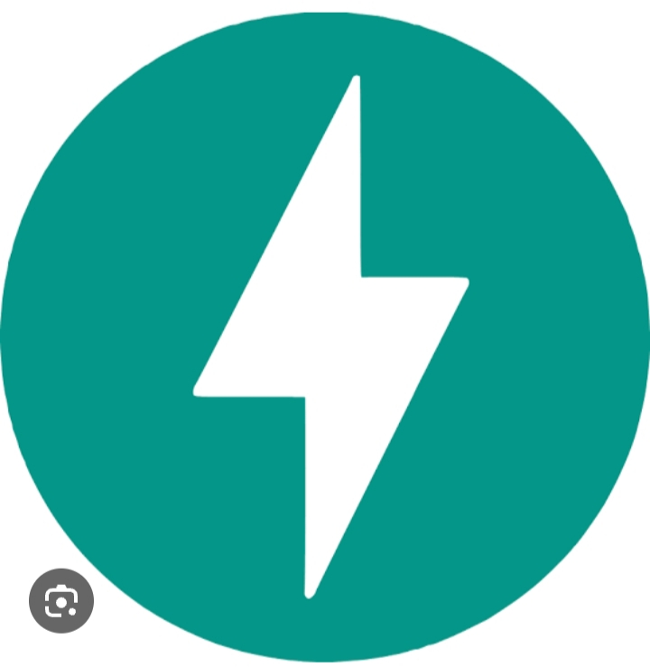
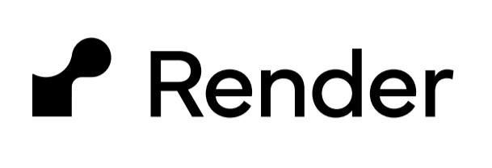

## 🌟 About Me

Hi, I’m Rahul K.S 👋

🔹 Engineering & AI Student Babuji Institute of Engineering and Technology

🔹 Passionate about Development, Startups, and AI Research

🔹 Exploring Flutter, Django, Node.js, and AI Agents

🔹 Interested in Hackathons, Open-Source Contributions, and Product Development

🔹 Love to create AI-powered applications, Web & Mobile Apps, and Startup Projects

🔹 Always learning and experimenting with new technologies & tools

---
## 💡 Current Focus:
🔹 Building Agent Store Project (AI Agents for automation)

---
## 🌍 Connect with Me

  
  
  
  

  

  

   
---

## 🛠 Tech Stack

**💻 Programming & Development**  

  

**⚙️ Frameworks & Tools**  

  

**API and Backend Server**

  
  
  
  
  

**☁️ Databases & Cloud**  

  

**🤖 AI & ML**  

  <!-- CrewAI (Custom Icon) -->
  
  
  <!-- CNN (Deep Learning Custom Icon) -->
  

----

<h2>📜 Certificates & Achievements</h2>

<h3>🎓 Professional & Technical Certifications</h3>

<ul>
  <li>🏅 <strong>MODEL_QUEST</li>
  <li>🏅 <strong>CODE QUEST 2.0</strong></li>
  <li>🏅 <strong>ML Ops Fundamental Masterclass</strong></li>
</ul>

  📂 <strong>Certificate Proof:</strong>
  <a href="certificates.md" target="_blank">View All Certificates</a>

---
## 💡Projects

    
   <a href="project.md" style="display: inline-block; margin-top: 10px; padding: 8px 15px; background-color: #007bff; color: #fff; border-radius: 10px; text-decoration: none;">View Projects>>>
   

     <strong>->I build the projects which I learnt the skills and i use those all skills and traid the projects,</strong> 
     

     <strong>->I builded the real world projects.</strong>
     

     <strong>->Please go through>>>>>></strong>
     

   </a>

---
## 📊 GitHub Stats
 

  
  

  

