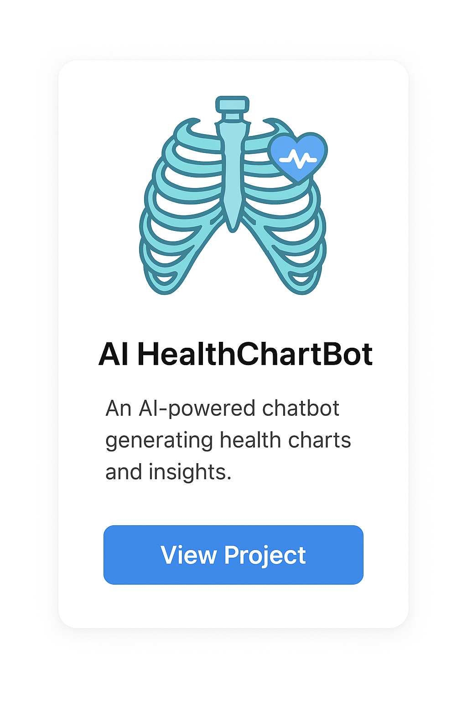

## 🌟 About Me

Hi, I’m Rahul K.S 👋

🔹 Engineering & AI Student at IIT Indore & Babuji Institute of Engineering and Technology

🔹 Passionate about Development, Startups, and AI Research

🔹 Exploring Flutter, Django, Node.js, and AI Agents

🔹 Interested in Hackathons, Open-Source Contributions, and Product Development

🔹 Love to create AI-powered applications, Web & Mobile Apps, and Startup Projects

🔹 Always learning and experimenting with new technologies & tools

---
## 💡 Current Focus:
🔹 Building Agent Store Project (AI Agents for automation)

---
## 🌍 Connect with Me

  
  
  
  

  

  

   
---

## 🛠 Tech Stack

**💻 Programming & Development**  

  

**⚙️ Frameworks & Tools**  

  

**API and Backend Server**

  
  
  
  
  

**☁️ Databases & Cloud**  

  

**🤖 AI & ML**  

  <!-- CrewAI (Custom Icon) -->
  
  
  <!-- CNN (Deep Learning Custom Icon) -->
  

---
## 💡Projects

 <!-- Project 1 -->
  
<h3 style="color: #333; margin: 10px 0;">Ordering App</h3>
    
A Flutter app that allows customers to place orders and shop owners to manage them efficiently.

    
    
   <a href="#" style="display: inline-block; margin-top: 10px; padding: 8px 15px; background-color: #007bff; color: #fff; border-radius: 8px; text-decoration: none;">View Project</a>
  

  <!-- Project 2 -->
  

    <h3 style="color: #333; margin: 10px 0;">Health_Agent</h3>
    
AI-powered automation project for managing tasks and operations efficiently.

    
    
  <a href="https://rahul14322982.github.io/Agent_Store/" style="display: inline-block; margin-top: 10px; padding: 8px 15px; background-color: #007bff; color: #fff; border-radius: 8px; text-decoration: none;">View Project</a>
  

---
## 📊 GitHub Stats
 

  
  

  

